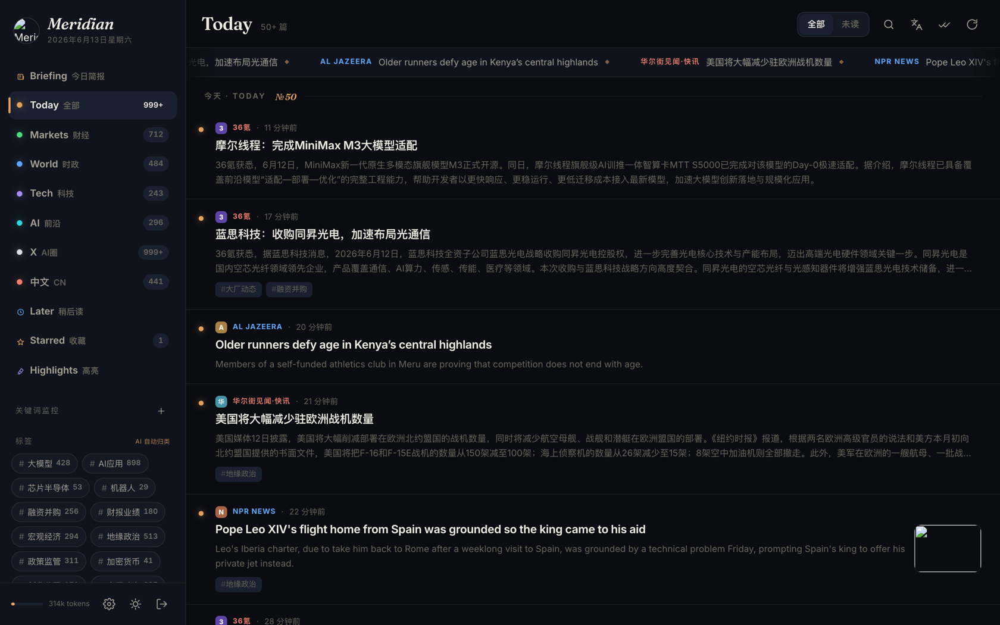
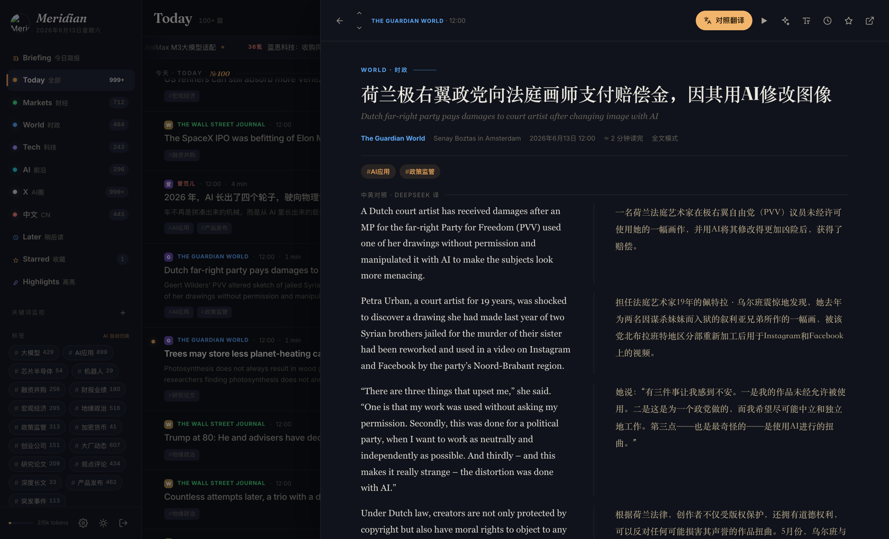
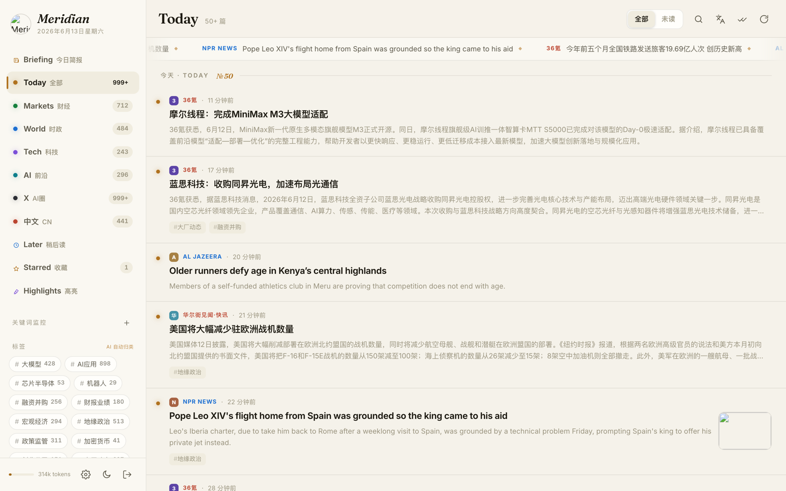

# Meridian · 子午线

> A self-hosted **bilingual RSS reader** for people who read a lot of finance,
> world, tech & AI news — inline DeepSeek translation, an editorial reading
> experience, and zero build step.
>
> 自部署的**双语 RSS 阅读器**，为每天要看大量财经・时政・科技・AI 资讯的人打造 ——
> DeepSeek 段落级对照翻译、editorial 排版、零构建。



## 简介 · Overview

**中文** — Meridian（子午线）打开文章先**秒显 RSS 摘要**、后台自动抓全文；任意外文文章
一键切换**段落级中英对照**（DeepSeek 翻译，逐篇缓存、同文不重复计费）。再加上自动打标签、
关键词监控、每日简报 + 实时行情、TL;DR 摘要、稍后读、朗读 —— 全部装进一个暗色优先、
键盘驱动的界面。原生 HTML/CSS/JS，无框架、无打包、无构建步骤。

**English** — Meridian shows the RSS summary instantly, pulls the full article in
the background, and flips any foreign-language piece into a paragraph-level
side-by-side translation (DeepSeek, cached per article). Plus auto-tagging,
keyword monitors, a daily digest with a live market ticker, TL;DR summaries,
read-later, and TTS — in a dark-first, keyboard-driven UI. Vanilla HTML/CSS/JS,
no framework, no bundler, no build step.

### 双语对照阅读 · Side-by-side bilingual reading

一键把外文长文变成左右对照，译文逐篇缓存。
One click turns a foreign article into side-by-side columns; translations are cached per article.



### 暗色 / 亮色双主题 · Dark & light themes



## 功能 · Features

- **双语阅读 Bilingual reading** — 段落级原文↔中文对照，DeepSeek 驱动，逐篇缓存不重复计费。
- **后台全文提取 Background full-text** — 先显 RSS 摘要，后台 trafilatura → [Jina Reader] 兜底抓全文，就绪后水合。
- **每日简报 Daily digest** — 自动生成的晨间简报，附实时行情条（指数 / 黄金 / 原油 / 加密货币）。
- **自动标签 Auto-tagging** — 固定高信号标签体系（大模型 / 芯片 / 融资 / 宏观…），由模型按主题归类。
- **关键词监控 Keyword monitors** — 把一个话题作为独立 feed 跨全部源追踪。
- **阅读工具 Reading tools** — TL;DR 摘要、划词翻译、稍后读、阅读进度恢复、相关阅读、朗读（TTS）。
- **editorial UI** — View-Transition 主题切换、自托管 Fraunces + Inter 变量字体、`Cmd+K` 命令面板、`j`/`k` 键盘流、无限滚动。

## 技术栈 · Stack

- **Backend** — FastAPI + SQLite (WAL), single uvicorn worker.
- **Frontend** — vanilla HTML/CSS/JS, served static. No build step.
- **Translation / summaries** — DeepSeek (`deepseek-v4-flash`) behind a daily token-budget gate.
- **Extraction** — trafilatura, falling back to `r.jina.ai` for JS-heavy / bot-walled pages.

`app/` modules: `config` (feeds + constants), `fetcher` (30-min poll, ETag,
noise scrubbing), `translate`, `extract`, `digest`, `discover` (add any URL →
auto-find its feed, with an SSRF guard), `tagger`, `market`, `sanitize`,
`auth`, `db`, `main`.

## 快速开始 · Quick start (local)

```bash
git clone https://github.com/piggyzenghz/meridian-reader.git
cd meridian-reader
python3 -m venv venv && venv/bin/pip install -r requirements.txt
cp .env.example .env          # 设置 MERIDIAN_PIN + DEEPSEEK_API_KEY
venv/bin/uvicorn app.main:app --port 3023
```

打开 <http://127.0.0.1:3023>，输入 PIN 即可。

## 部署 · Deploy (systemd + reverse proxy)

```bash
# 在服务器上，用非 root 用户
git clone https://github.com/piggyzenghz/meridian-reader.git ~/meridian
cd ~/meridian
python3 -m venv venv && venv/bin/pip install -r requirements.txt
cp .env.example .env && chmod 600 .env       # 填入你的密钥

sudo cp deploy/meridian.service /etc/systemd/system/
# 按你的机器改 unit 里的 User= 和路径
sudo systemctl daemon-reload
sudo systemctl enable --now meridian
```

服务监听 `127.0.0.1:3023` —— 用 nginx / Caddy / Cloudflare Tunnel 套 TLS 对外。
The app binds to `127.0.0.1:3023`; front it with nginx / Caddy / a Cloudflare Tunnel for TLS.

```bash
sudo systemctl restart meridian   # 重启 / restart
journalctl -u meridian -f         # 看日志 / tail logs
```

## 配置 · Configuration

全部通过环境变量（`.env`）/ everything via the environment:

| Variable | Default | Notes |
|---|---|---|
| `MERIDIAN_PIN` | — | 访问密码 gate password (**required**) |
| `DEEPSEEK_API_KEY` | — | 翻译 + 摘要必需 (**required**) |
| `DEEPSEEK_MODEL` | `deepseek-v4-flash` | any DeepSeek-compatible model |
| `MERIDIAN_PORT` | `3023` | bind port |
| `MERIDIAN_FETCH_INTERVAL_MIN` | `30` | feed poll interval |
| `MERIDIAN_DAILY_TOKEN_BUDGET` | `3000000` | DeepSeek 日 token 上限 |
| `JINA_API_KEY` | — | optional; 提高 Jina Reader 速率上限 |

源在网页内管理（⚙ 设置：增删 / 启停 / 分类），或在 `app/config.py` 里预置。
所有阅读数据（收藏、高亮、已读、译文缓存）都在 `data/meridian.db`（已 gitignore）—— 备份这个文件即可，服务本身无状态。

## 键盘 · Keyboard

`j`/`k` 上下篇 · `o`/`Enter` 打开 · `b` 中英对照 · `s` 收藏 ·
`l` 稍后读 · `t` 翻译标题 · `r` 刷新 · `d` 切主题 · `Cmd+K` 命令面板。

## 致谢 · Credits

- X/Twitter 默认源选自 [SuYxh/ai-news-aggregator](https://github.com/SuYxh/ai-news-aggregator)。
- 字体 Fonts: [Fraunces](https://github.com/undercasetype/Fraunces) · [Inter](https://github.com/rsms/inter).
- 全文兜底 Full-text fallback: [Jina Reader](https://jina.ai/reader/).

## License

[MIT](LICENSE)

[Jina Reader]: https://jina.ai/reader/
